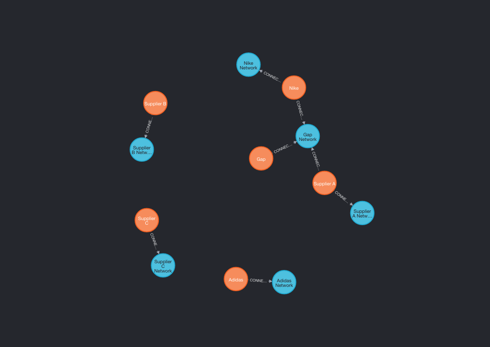

# Neo4j Demo

a demo project to learn neo4j

# Visualize



# Endpoints

`POST` `/api/company`

create company and company network

Request:

```json
{
  "name": "Supplier A",
  "address": "Hong Kong"
}
```

`GET` `/api/company/my-network`

get company network that a company joined

Response:

```json
{
  "networks": [
    {
      "companyNetworkName": "Gap Network",
      "partnerRole": "VIEWER"
    },
    {
      "companyNetworkName": "Nike Network",
      "partnerRole": "OWNER"
    }
  ]
}
```

`POST` `/api/company-network/connect`

connect an existing company to another company network

Request:

```json
{
  "companyId": "a3414d36-0027-4c77-a528-68858b5e51d4",
  "partnerRole": "CONTRIBUTOR"
}
```

`GET` `/api/company-network`

retrieve company network

Response:

```json
{
  "companies": [
    {
      "companyId": "a30b0165-fc4d-45df-871f-b9286f71b8aa",
      "name": "Supplier A",
      "address": "Hong Kong",
      "partnerRole": "CONTRIBUTOR"
    },
    {
      "companyId": "a3414d36-0027-4c77-a528-68858b5e51d4",
      "name": "Nike",
      "address": "Hong Kong",
      "partnerRole": "VIEWER"
    },
    {
      "companyId": "8339172a-c2a5-40ec-8c5f-6fe88577a491",
      "name": "Gap",
      "address": "Hong Kong",
      "partnerRole": "OWNER"
    }
  ]
}
```
